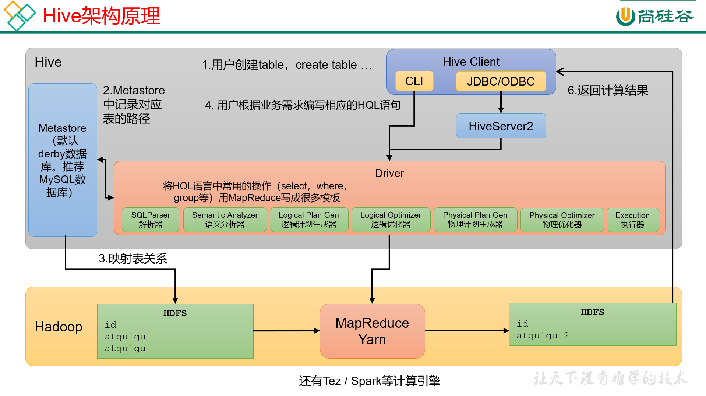

# Hive
## Hive 简介
> Hive 是由Facebook开源，基于Hadoop的一个数据仓库工具，可以将结构化的数据文件映射为一张表，并提供类sql查询功能
> 为解决mapreduce程序的繁杂而诞生，使用Hive后不再需要手写mapreduce程序，底层实现还是使用mapreduce，
> 由Hive程序根据sql语句自动生成。
## Hive本质
Hive是一个Hadoop的客户端，用于将HQL（Hive sql）转化为mapreduce程序
- Hive中每张表的数据存储在HDFS上
- Hive分析数据底层的实现是MapReduce，（也可配置为spark或者Tez）
- 执行程序运行在yarn上
## Hive架构原理

### 用户接口：Client
> CLI（command-line interface）、JDBC/ODBC
#### JDBC和ODBC的区别
> 1. JDBC的移植性比ODBC好；通常情况下，安装完ODBC驱动程序后，还需要经过确定的配置才能够应用，
> 而不相同的配置在不同的数据库服务器之间是不能够通用的。所以安装一次就需要再配置一次。
> JDBC只需要选取合适的JDBC驱动程序，就不需要额外的配置，在安装过程中JDBC数据库驱动程序会自己
> 完成有关的配置。
> 2. 两者使用的语言不同，JDBC在java编程时使用，ODBC一般在c/c++编程时使用
#### 元数据：Metastore
> 元数据包括：数据库（默认时default）、表名、表的拥有者、列/分区字段、表的类型（是否时外部表）、表的数据所在的目录
> 默认存储在自带的derby数据库中，由于derby数据库只支持单客户端访问，在生产环境中为了多人开发，推荐使用mysql存储metastore
#### 驱动器：Driver
1. 解析器（SQLParser）：将SQL字符串转换成抽象语法树
