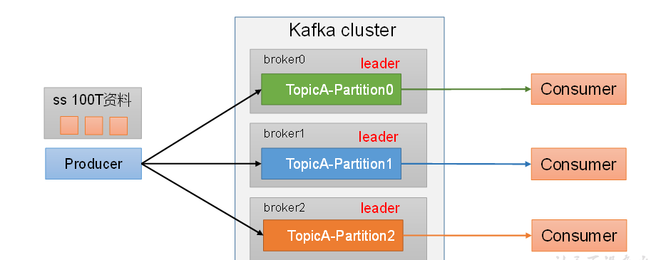
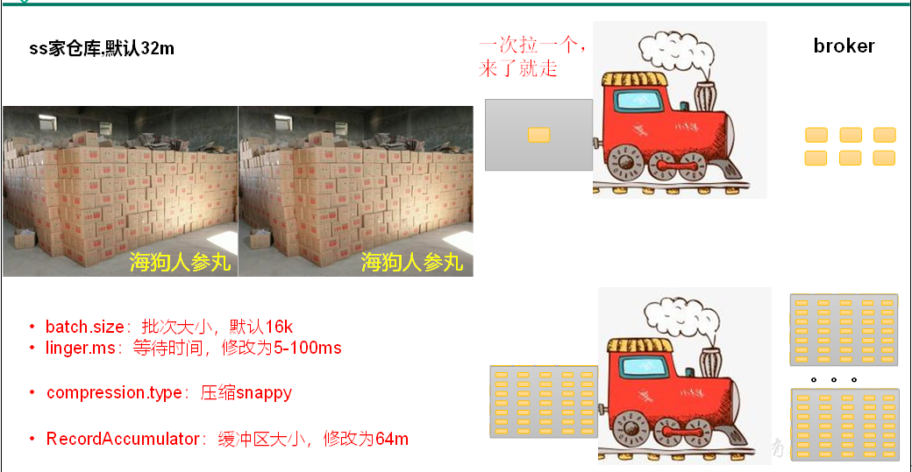
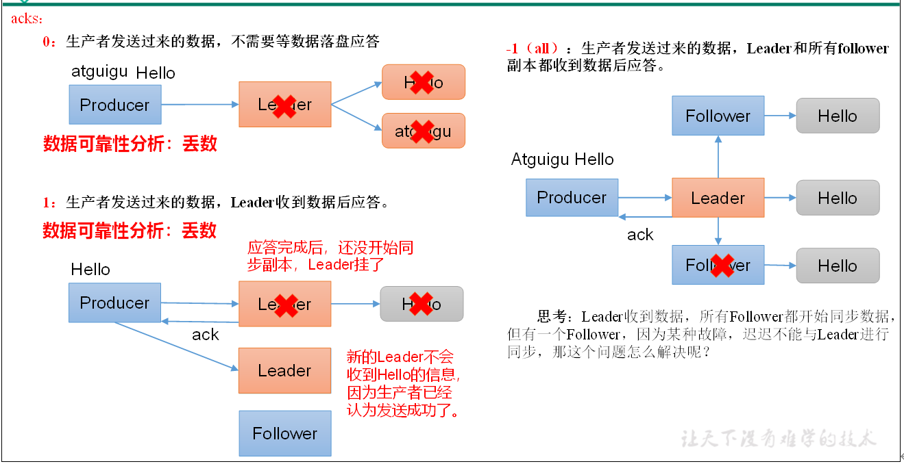
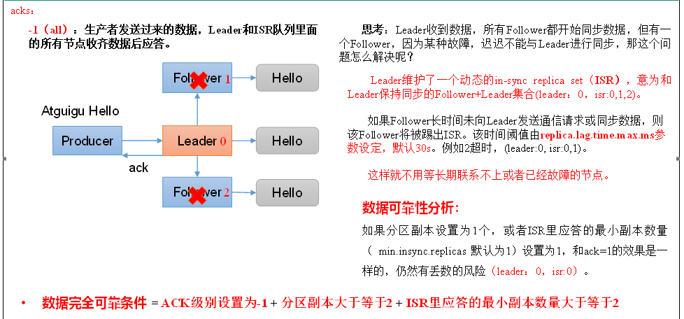
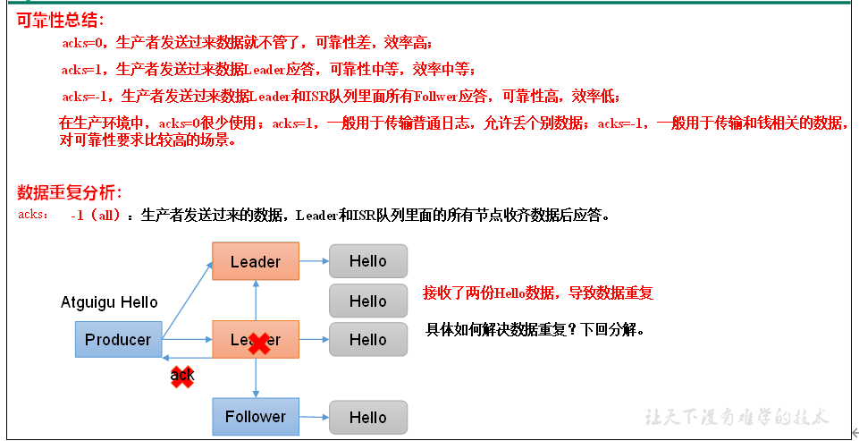
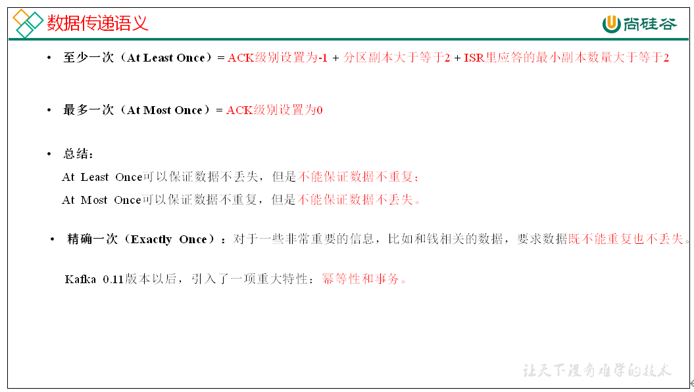
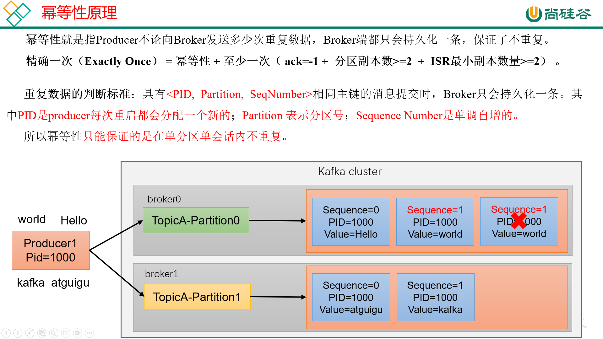
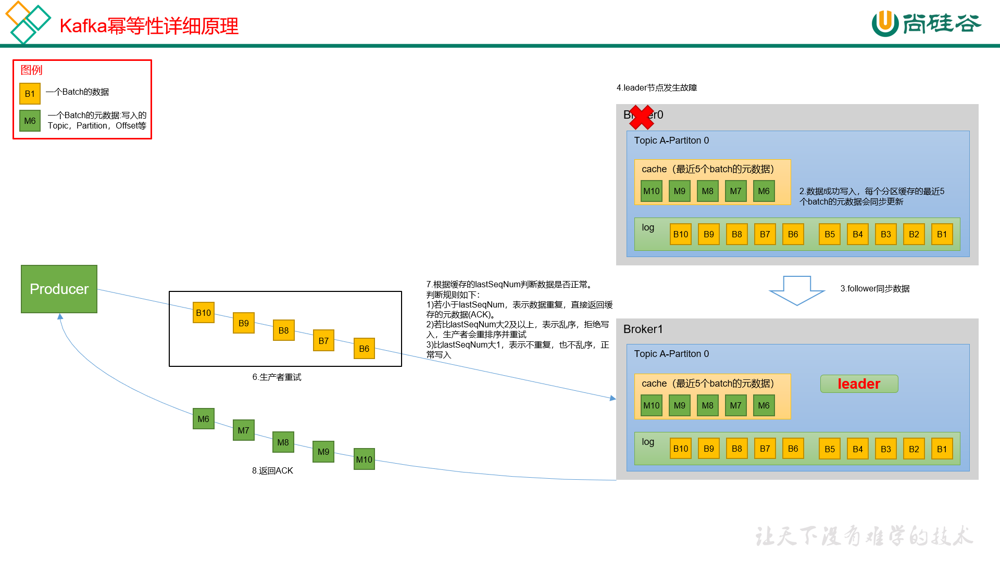

# kafka 概述
>    kafka 是一个分布式的基于发布/订阅模式的消息队列框架

### 发布/订阅模式
>    可以理解为生产者和消费者模式，消息的发布者不会直接将消息发送给订阅者，
>    而是将发布的消息分为不同的类型，放到队列中，由订阅者自己去队列中去接收感兴趣的消息

### 消息队列
>    企业中常见的消息队列产品：kafka，ActiveMQ，RabbitMQ，RocketMQ
>    大数据场景下主要采用kafka
### 消息队列的主要应用场景
>    - 缓存/削峰：有助于控制和优化数据流经过系统的速度，解决生产消息和消费消息的处理速度不一致的情况
>    - 解耦：允许你独立的扩展或者修改两边的处理过程，只要保证它们遵循同样的接口约束，互不影响。
>    - 异步通信：允许用户把一个消息放入队列，但并不立即处理它，然后在需要的时候再去处理它们。
### 消息队列的两种模式
>    - 点对点模式：消费者主动拉取消息，消息收到后清除消息
>    - 发布/订阅模式：
>        + 可以有多个topic主题（如浏览，点赞，收藏，评论等）
>        + 消费者消费数据之后不会立刻清楚数据，有框架统一管理删除
>        + 每个消费者相互独立，都可以消费到数据
## kafka 基础架构
>    - 为方便扩展，并提高高吞吐量，一个topic分为多个partition
>    - 配合分区设计，提出消费者组的概念，组内每个消费者并行消费
>    - 为提高可用性，为每个partition增加若干个副本，类似NameNode HA
>    - 默认依赖zookeeper，zookeeper中记录谁是leader，
>    kafka2.8.0之后可以配置不采用zookeeper，一种全新的模式：Kraft模式
### kafka基础架构组成名词解释
>    - Producer：消息生产者，就是向kafka broker发布消息的客户端
>    - Consumer：消息消费者，就是从kafka broker取消息的客户端
>    - Consumer Group：消费者组，由多个consumer组成,消费组内的每个消费者负责消费不同分区的数据，
>       一个topic下的一个分区只能被一个消费组内的一个消费者消费，消费者之间互不影响，
>       消费者组是逻辑上的一个订阅者
>    - Broker：一个kafka服务器就是一个broker,一个broker可以容纳多个topic
>    - Topic：可以理解为一个队列，生产者和消费者面向的都是一个topic
>    - Partition：为了实现扩展性，一个非常大的topic可以分布到多个broker上，
>      一个topic可以分为多个partition，每个partition都是一个有序的队列
>    - Replica：副本，为保证集群中的某个节点发生故障时，
>       该节点上的partition数据不丢失，且kafka任能继续工作，kafka提供了副本机制，
>       一个topic的每个partition都有若干个副本，一个leader和若干个follower
>    - leader：每个分区副本的“主”，生产者发送数据的对象，以及消费者消费的对象都是leader
>    - follower：每个分区副本的“从”，主动实时的和leader同步数据，在leader发生故障时，成为新的leader
## kafka 快速入门
### 安装部署
>   1. 官网下载[kafka官网](http://kafka.apache.org/downloads.html)
>   2. 上传到服务器并解压
>       ```shell
>        tar -zxvf kafka 
>        ```
>   3. 修改config目录下的配置文件 **server.properties**
>       ```
>           #broker的全局唯一编号，不能重复只能是数字
>           broker.id=102
>           #处理网络请求的线程数量
>           num.network.threads=3
>           #用来处理磁盘IO的线程数量
>            num.IO.threads=8
>           #发送套接字的缓冲区大小
>           socket.send.buffer.bytes=102400
>           #接收套接字的缓冲区大小
>           socket.receive.buffer.bytes=102400
>           #请求套接字的缓冲区大小
>           socket.request.max.bytes=104857600
>           #kafka运行日志（数据）存放的路径,路径不需要提前创建，kafka自动帮你创建
>           #可以配置多个磁盘路径，路径和路径之间可以用“，”分隔
>           log.dirs=/opt/module/kafka/datas
>           #topic在当前broker上的分区个数
>           num.partitions=1
>           #用来恢复和清理data下数据的线程数
>           num.recovery.threads.per.data.dir=1
>           #每个topic创建时的副本数量，默认是1个副本
>           offsets.topic.replication.factor=1
>           #segment 文件保留的最长时间，超时将被删除
>           log.retention.hours=168
>           #每个segment 文件的大小，默认最大1G
>           log.segment.bytes=1073741824
>           #检查过期数据的时间，默认5分钟检查一次是否数据过期
>           log.retention.check.interval.ms=300000
>           #配置连接Zookeeper集群地址，（在zookeeper根目录创建/kafka,方便管理）
>           zookeeper.connect=hadoop102:2181,hadoop103:2181,hadoop104:2181/kafka
>       ```
>   4. 配置环境变量,并分发生效
>   5. 分发安装包
>   6. 修改配置文件中的broker.id
>   7. 启动集群<br>
>       **i.启动zookeeper集群：zk start**<br>
>       **ii.依次在三个节点上启动kafka：bin/kafka-server-start.sh -daemon config/server.properties**<br>
>       **iii.关闭集群：bin/kafka-server-stop.sh**
### kafka群起脚本
#### 脚本编写
```bash
#!/bin/bash
if[ $# == 0 ]
then
    echo -e "请输入参数：\n start: 启动集群\n stop:停止集群\n" && exit
fi
case $1
    "start")
        for host in hadoop102 hadoop103 hadoop104
            do
                echo "==============$host 启动 kafka 集群 ===============
                ssh $host "cd /opt/module/kafka; bin/kafka-server-start.sh -daemon config/server.properties"
            done 
        ;;
    "stop")
        for host in hadoop102 hadoop103 hadoop104
            do
                echo "==============$host 关闭 kafka 集群 ===============
                ssh $host "cd /opt/module/kafka; bin/kafka-server-stop.sh"
            done 
        ;;
    *)
        echo "=============请输入正确的参数================"
        echo -e "start  启动kafka集群;\n stop  停止kafka集群;\n" && exit
        ;;
esac 
``` 
#### 脚本文件添加权限
```linux
sudo chmod 777 kafka
```
#### 注意
> **停止kafka集群时，一定要等kafka集群全部停止完毕后再停止zookeeper集群**
> 因为zookeeper集群中记录者kafka集群的相关信息，zookeeper集群一旦先停止
> kafka集群就无法获取停止进程的信息，只能手动杀死kafka进程
### kafka命令行操作
#### 操作topics命令
>    kafka-topics.sh [参数]
>    1. 查看当前服务器中的所有topic
>       kafka-topics.sh --bootstrap-server hadoop102:9092 --list 
>    2. 创建一个主题名为first的topic
>       kafka-topics.sh --bootstrap-server hadoop102:9092 --create --replication-factor 3 --partitions 1 --topic first
>    3. 查看topic的详情
>      kafka-topics.sh --bootstrap-server hadoop102:9092 --describe --topic first
>    4. 修改分区数 **（注意：分区数只能增加，不能减少）**
>       kafka-topics.sh --bootstrap-server hadoop102:9092 --alter --topic first --partitions 3
>   5.删除topic
>       kafka-topics.sh --bootstrap-server hadoop102:9092 --delete --topic first   
##### 主要参数
| 参数 | 描述 |
|:----:|:----:|
|--bootstrap-server|连接kafka broker主机名称和端口号|
|--topic|操作的topic名称|
|--create|创建主题|
|--delete|删除主题|
|--alter|修改主题|
|--list|查看所有的主题|
|--describe|查看主题详细描述|
|--partitions|设置主题分区数|
|--replication-factor|设置主题分区副本|
|--config|更新系统默认的配置|
#### 生产者命令行操作
##### 命令
```linux
 kafka-console-producer.sh [参数]
```
>   1.生成消息
>       kafka-console-producer.sh --bootstrap-server hadoop102:9092 --topic first
##### 主要参数
|参数|描述|
|:----------:|:--------------:|
|--bootstrap-server|连接kafka broker主机名称和端口号|
|--topic|操作topic的名称|
#### 消费者命令行操作
##### 命令
```linux
    kafka-console-consumer.sh [参数]
```
> 1.消费消息
>   kafka-console-consumer.sh --bootstrap-server hadoop:102 --topic first
> 2.从头开始消费
>   kafka-console-consumer.sh --bootstrap-server hadoop:102 --from-begining --topic first
##### 主要参数
|参数|描述|
|:--:|:--:|
|--bootstrap-server|连接kafka broker主机名称和端口号|
|--topic|操作topic的名称|
|--from-begining|从头开始消费|
|--group|指定消费组名称|
## kafka 生产者
### 生产者消息发送流程
#### 发送原理
> kafka 的 Producer发送消息采用的是**异步发送**的方式
> 在消息的发送过程中，涉及到2个线程：**main线程**和**Sender线程**，
> 以及一个线程共享变量：**RecordAccumular**
>
> main线程中创建了一个**双端队列RecordAccumular**,将消息发送到RecordAccumular
> sender线程不断的从RecordAccumular中拉取数据发送到kafka broker


#### 生产者重要参数
|参数|描述|
|:-|-|
|bootstrap.server|生产者连接集群所需要的broker ip地址和端口 清单，可以配置1个或多个，中间用“，”隔开。生产者从给定的broker里查找到其他broker信息|
|key.seriallizer、value.seriallizer|指定发送消息的key和value的序列化类型，要写全类名|
|buffer.memory|RecordAccumular缓存去的总大小，默认32m|
|batch.size|缓冲区一批数据最大值，默认16k,适当增加该值，可以提高吞吐量，但是如果该值设置过大，会导致数据传输延迟增加|
|linger.ms|如果数据迟迟未达到**batch.size**,sender等待**linger.time**之后就会发送数据，单位是ms，默认是0ms，表示没有延迟。生产环境建议该值大小为5-100ms之间|
|acks|0：生产者发送过来的数据，不需要等数据落盘应答<br>1:生产者发送过来的数据，Leader数据落盘后应答<br>-1(all):生产者发送过来的数据，Leader和isr队列里的所有节点数据都落盘后应答。默认值是-1|
|max.in.flight.requests.per.connection|允许最多没有返回ack的次数，默认是5，开启幂等性要保证该值是1-5的数字|
|retries|当消息发送错误的时候，系统会重新发送消息，retries表示重试次数，默认值是int的最大值，2147483647<br>如果设置了重试，还想保证消息的有序性，需要设置MAX_IN_FLIGHT_REQUESTS_PER_CONNECTION=1,否则在重试此失败消息的时候，其他消息可能发送成功了|
|retry.backoff.ms|两次重试之间的时间间隔，默认是100ms|
|enable.idempotence|是否开启幂等性，默认true，开启幂等性|
|compression.type|生产者发送的所有数据的压缩方式，默认是none，不压缩，支持的压缩类型：none、gzip、snappy、lz4、zstd|
### 异步发送API
#### 普通异步发送(不带回调函数)
###### 编写代码实现异步发送数据（producer）
1. 创建maven工程，导入kafka依赖
    ```xml
    <!-- https://mvnrepository.com/artifact/org.apache.kafka/kafka-clients -->
    <dependencies>
        <dependency>
            <groupId>org.apache.kafka</groupId>
            <artifactId>kafka-clients</artifactId>
            <version>3.3.1</version>
        </dependency>
    </dependencies>
    ```
2. create package and class :com.zenghaifeng.kafka.CustomProducer
3. edit code
    ```java
   package com.zenghaifeng.kafka;
    
    import java.util.Properties;
    import org.apache.kafka.clients.producer.ProducerConfig;
    import org.apache.kafka.common.serialization.StringSerializer;
    import org.apache.kafka.clients.KafkaProducer;
    import org.apache.kafka..cliet.ProducerRecord;
   public class CustomProducer{
    public static void main(String[] args){
            //create configuration object
            Properties properties = new Properties();
            
            //put config
            properties.put(ProducerConfig.BOOTSTRAP_SERVERS_CONFIG,"hadoop102:9092");//connection ip and port
            properties.put(ProducerConfig.KEY_SERIALIZER_CLASS_CONFIG,StringSerializer.class.getName());//set key serializer class
            properties.put(ProducerConfig.VALUE_SERIALIZER_CLASS_CONFIG,StringSerializer.class.getName());//set vlue serializer class

            //create Producer object
            KafkaProducer producer = new KafkaProducer(properties);
            //call `send` method to send message
            for(int i = 1; i <= 10; i++){
                producer.send(new ProducerRecord<>("first",i+" 号技师为您服务！"));
            }
            //close resources
            producer.close();
        }
   }
   ```
4. test
   - hadoop102 create consumer
   - do code running
#### 带回调函数的异步发送
> callback function 会在producer 收到ack时调用，为异步调用
>   this function have two parameters,**RecordMetadata(元数据信息)** and **Exception(异常信息)**
>   - if Exception is null ,then send message is success
>   - if Exception is not null ,then send message is failure
> **PS: if send message failure,it will automatic retry,haven't manual retry on callback function**
##### edit code
```java
    //...
    for(int i = 1; i <= 10; i++>){
        final ProducerRecord<String,String> producerRecord = new ProducerRecord<String,String>("first",i+" 号技师为您服务！");
        System.out.println("你看我在哪");
        producer.send(producerRecord,new Callback(){
            @override
            public void onCompletion(RecordMetadata recordMetadata,Exception e){
                if(e == null){
                    System.out.println("topic:" + recordMetadata.topic + "partition:" + recordMetadata.partition + "offset:" + recordMetadata.offset );
                }
            }
        });
    }
    //...
```
### 同步发送
> 同步发送的意思是，一条消息发送后，会阻塞当前线程，直至返回ack。
> 由于send方法返回的是一个Feture对象，根据Feture对象的特点，
> 我们也可以实现同步发送的效果，只需要在调用Feture对象的get()方法即可。
##### edit code
```java
//...
producer.send(producerRecord,new Callback(){}).get();
//...
```
### 生产者分区
#### 生产者分区的优势
> 1. 便于合理使用存储资源，每个partitiion在一个broker上存储，可以把海量的数据按照分区切割成一块一块数据存储在多台broker上。合理控制分区的任务，可以实现负载均衡的效果
> 2. 提高并行度，生产者可以以分区为单位发送数据，消费者可以以分区为单位进行消费数据
> 
#### 生成者分区策略
> 1. 默认分区器：DefaultPartitioner
> 2. usage:
>   - 我们需要将producer发送的数据封装成一个ProducerRecord对象
>   - 上述的分区策略，我们在ProducerRecord对象中配置
#### 策略实现
|参数|解释|
|:-|-|
|ProducerRecord(topic,partition_num,...)|指明partition的情况下直接发往指定的分区|
|ProducerRecord(topic,key,vulue)|没有指明partition，但是有key的情况下：将key的hash值与topic的partition的个数进行取余得到要发往的partition的id|
|ProducerRecord(topic,value)|既没有partition值，又没有key值的情况下：kafka采用Sticky partition(粘性分区器)，会随机选择一个分区，并尽可能一直使用该分区，待该分区的batch已满或者已完成，kafka再随机选择一个分区使用（绝对不会是上次选择的分区）|
#### 自定义分区器
> 1. 生产环境中，我们往往需要更加自由的分区需求，我们可以自定义分区
> 2. 实现步骤
>   - 定义类，实现Partitioner接口
>   - 重写partition() method
##### code
```java
package com.zenghaifeng.kafka.producer;

import org.apacher.kafka.client.producer.Partitioner;
import org.apache.kafka.common.Cluster;
import java.util.Map;

pulic class CustomProducer implements Partitioner{
    @override
    public int partition(String topic, Object key,byte[] keyBytes,Object value,byte[] valueBytes,Cluster cluster){
        String keyStr = key.toString();
        int i = keyStr.hashCode();
        int partition = (i & Integer.MAX_VALUE) % cluster.partitionCountForTopic("first");
        return partition
    }

    @override
    public void close(){
        
    };  

    @override
    public void configure(Map<String,?> config){
    
    };  
}
```
#### test
```java
//在生产者代码中添加分区器配置
properties.put(ProducerConfig.PARTITIONER_CLASS_CONFIG,"com.zenghaifeng.kafka.producer.CustomPartitioner");
```
### 生产经验--生产者如何提高吞吐量

> 在生产者配置对象中配置
>```java
>// batch.size:批次大小，默认16k
>properties.put(ProducerConfig.BATCH_SIZE_CONFIG,16384);
>
>//lnigner.ms : 等待时间，默认0
>properties.put(ProducerConfig.LINGER_MS_CONFIG,1);
>
>//RecordAccumulator:缓冲区大小，默认32M：buffer.memory
>properties.put(ProducerConfig.BUFFER_MEMORY_CONFIG,33554432);
>
>//compression.type :压缩，默认none，可配置gzip，snappy，lz4和zstd
>properties.put(ProducerConfig.COMPRESSION_TYPE_CONFIG,"snappy");
>```
### 生产经验-数据可靠性
#### ack应答机制

### ack应答级别
> 对于某些不太重要的数据，对数据的可靠性的要求不是很高，能够容忍数据的少量丢失，所以没必要等ISR中的follower全部接收成功。
> 所以kafka为用户提供了3种可靠性级别，用户可以根据对可靠性和延迟的要求进行权衡，选择以下配置
> |级别|解释|
> |:-|-|
> |acks=0|这一操作提供了一个最低的延迟，partition的leader副本接收到消息还没写入磁盘就已经返回ack，当leader故障时有可能丢失数据|
> |acks=1|partition的leader接收到数据，落盘后返回ack，如果在follower同步数据之前leader故障，那么将会丢失数据|
> |acks=-1(all)|partition的leader和follower全部落盘成功后才返回ack。但是如果在follower同步完数据后，leader发送ack之前leader故障，那么会造成数据重复|


> 背景：设置ack应答级别为（-1），那么leader收到数据，所有follower都开始同步数据，但有一个follower，因为某种故障，迟迟不能与leader进行同步，那么leader就要一直等下去，直到它完成同步，才能发送ack应答，这个问题怎么解决？
>
> kafka提供的解决方案 ISR队列：
> - leader维护了一个动态的 in-sync replica set (ISR) ：和leader保持同步follower集合
> - 当ISR中的follower完成数据的同步后，leader给producer发送ack应答
> - 如果follower长时间（replica.lag.time.max.ms）未向leader同步数据，则该follower将被踢出ISR。
> - leader发生故障后，就会从ISR中选举新的leader
#### ack应答机制总结


###### code:set ack
```java
 // 设置acks
properties.put(ProducerConfig.ACKS_CONFIG, "all");
// 重试次数retries，默认是int最大值，2147483647
properties.put(ProducerConfig.RETRIES_CONFIG, 3);
```
### 生产经验--数据去重
#### 数据传递语义

##### 幂等性
> 1. 幂等性原理：
>   
> 2. idempotence describe
>    
> 3. 开启幂等性
>   在producer的配置对象中，添加enable.idempotence,参数默认值为true，设置false就关闭了
#### 生产者事物
> &emsp;&emsp;0.11版本的kafka同时引入了事物的特性，为了实现跨分区会话的事物，需要引入一个全局唯一的Transaction ID，需要将producer获得的PID和TRansaction ID 绑定。这样当producer重启后就可以通过正在进行的Transaction ID 获得原来的PID。<br>
> &emsp;&emsp;为了管理Transaction，kafka引入了一个新的组件Transaction Coordinator.producer就是通过和Transaction Coordinator交互获得Transaction ID对应的任务状态，Transaction coordinator还负责将事物所有写入kafka的内部topic，这样即使整个服务重启，由于事物状态得到保存，进行中的事物状态可以得到恢复，从而继续进行。<br>
> PS：提前开启幂等性！！！


