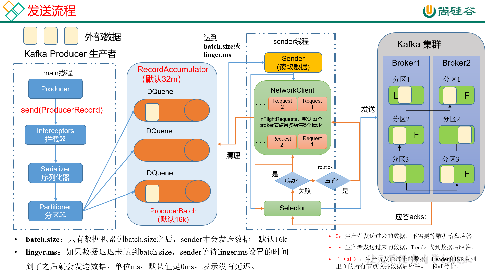

# kafka 概述
>    kafka 是一个分布式的基于发布/订阅模式的消息队列框架

### 发布/订阅模式
>    可以理解为生产者和消费者模式，消息的发布者不会直接将消息发送给订阅者，
>    而是将发布的消息分为不同的类型，放到队列中，由订阅者自己去队列中去接收感兴趣的消息

### 消息队列
>    企业中常见的消息队列产品：kafka，ActiveMQ，RabbitMQ，RocketMQ
>    大数据场景下主要采用kafka
### 消息队列的主要应用场景
>    - 缓存/削峰：有助于控制和优化数据流经过系统的速度，解决生产消息和消费消息的处理速度不一致的情况
>    - 解耦：允许你独立的扩展或者修改两边的处理过程，只要保证它们遵循同样的接口约束，互不影响。
>    - 异步通信：允许用户把一个消息放入队列，但并不立即处理它，然后在需要的时候再去处理它们。
### 消息队列的两种模式
>    - 点对点模式：消费者主动拉取消息，消息收到后清除消息
>    - 发布/订阅模式：
>        + 可以有多个topic主题（如浏览，点赞，收藏，评论等）
>        + 消费者消费数据之后不会立刻清楚数据，有框架统一管理删除
>        + 每个消费者相互独立，都可以消费到数据
## kafka 基础架构
>    - 为方便扩展，并提高高吞吐量，一个topic分为多个partition
>    - 配合分区设计，提出消费者组的概念，组内每个消费者并行消费
>    - 为提高可用性，为每个partition增加若干个副本，类似NameNode HA
>    - 默认依赖zookeeper，zookeeper中记录谁是leader，
>    kafka2.8.0之后可以配置不采用zookeeper，一种全新的模式：Kraft模式
### kafka基础架构组成名词解释
>    - Producer：消息生产者，就是向kafka broker发布消息的客户端
>    - Consumer：消息消费者，就是从kafka broker取消息的客户端
>    - Consumer Group：消费者组，由多个consumer组成,消费组内的每个消费者负责消费不同分区的数据，
>       一个topic下的一个分区只能被一个消费组内的一个消费者消费，消费者之间互不影响，
>       消费者组是逻辑上的一个订阅者
>    - Broker：一个kafka服务器就是一个broker,一个broker可以容纳多个topic
>    - Topic：可以理解为一个队列，生产者和消费者面向的都是一个topic
>    - Partition：为了实现扩展性，一个非常大的topic可以分布到多个broker上，
>      一个topic可以分为多个partition，每个partition都是一个有序的队列
>    - Replica：副本，为保证集群中的某个节点发生故障时，
>       该节点上的partition数据不丢失，且kafka任能继续工作，kafka提供了副本机制，
>       一个topic的每个partition都有若干个副本，一个leader和若干个follower
>    - leader：每个分区副本的“主”，生产者发送数据的对象，以及消费者消费的对象都是leader
>    - follower：每个分区副本的“从”，主动实时的和leader同步数据，在leader发生故障时，成为新的leader
## kafka 快速入门
### 安装部署
>   1. 官网下载[kafka官网](http://kafka.apache.org/downloads.html)
>   2. 上传到服务器并解压
>       ```shell
>        tar -zxvf kafka 
>        ```
>   3. 修改config目录下的配置文件 **server.properties**
>       ```
>           #broker的全局唯一编号，不能重复只能是数字
>           broker.id=102
>           #处理网络请求的线程数量
>           num.network.threads=3
>           #用来处理磁盘IO的线程数量
>            num.IO.threads=8
>           #发送套接字的缓冲区大小
>           socket.send.buffer.bytes=102400
>           #接收套接字的缓冲区大小
>           socket.receive.buffer.bytes=102400
>           #请求套接字的缓冲区大小
>           socket.request.max.bytes=104857600
>           #kafka运行日志（数据）存放的路径,路径不需要提前创建，kafka自动帮你创建
>           #可以配置多个磁盘路径，路径和路径之间可以用“，”分隔
>           log.dirs=/opt/module/kafka/datas
>           #topic在当前broker上的分区个数
>           num.partitions=1
>           #用来恢复和清理data下数据的线程数
>           num.recovery.threads.per.data.dir=1
>           #每个topic创建时的副本数量，默认是1个副本
>           offsets.topic.replication.factor=1
>           #segment 文件保留的最长时间，超时将被删除
>           log.retention.hours=168
>           #每个segment 文件的大小，默认最大1G
>           log.segment.bytes=1073741824
>           #检查过期数据的时间，默认5分钟检查一次是否数据过期
>           log.retention.check.interval.ms=300000
>           #配置连接Zookeeper集群地址，（在zookeeper根目录创建/kafka,方便管理）
>           zookeeper.connect=hadoop102:2181,hadoop103:2181,hadoop104:2181/kafka
>       ```
>   4. 配置环境变量,并分发生效
>   5. 分发安装包
>   6. 修改配置文件中的broker.id
>   7. 启动集群<br>
>       **i.启动zookeeper集群：zk start**<br>
>       **ii.依次在三个节点上启动kafka：bin/kafka-server-start.sh -daemon config/server.properties**<br>
>       **iii.关闭集群：bin/kafka-server-stop.sh**
### kafka群起脚本
#### 脚本编写
```bash
#!/bin/bash
if[ $# == 0 ]
then
    echo -e "请输入参数：\n start: 启动集群\n stop:停止集群\n" && exit
fi
case $1
    "start")
        for host in hadoop102 hadoop103 hadoop104
            do
                echo "==============$host 启动 kafka 集群 ===============
                ssh $host "cd /opt/module/kafka; bin/kafka-server-start.sh -daemon config/server.properties"
            done 
        ;;
    "stop")
        for host in hadoop102 hadoop103 hadoop104
            do
                echo "==============$host 关闭 kafka 集群 ===============
                ssh $host "cd /opt/module/kafka; bin/kafka-server-stop.sh"
            done 
        ;;
    *)
        echo "=============请输入正确的参数================"
        echo -e "start  启动kafka集群;\n stop  停止kafka集群;\n" && exit
        ;;
esac 
``` 
#### 脚本文件添加权限
```linux
sudo chmod 777 kafka
```
#### 注意
> **停止kafka集群时，一定要等kafka集群全部停止完毕后再停止zookeeper集群**
> 因为zookeeper集群中记录者kafka集群的相关信息，zookeeper集群一旦先停止
> kafka集群就无法获取停止进程的信息，只能手动杀死kafka进程
### kafka命令行操作
#### 操作topics命令
>    kafka-topics.sh [参数]
>    1. 查看当前服务器中的所有topic<br>
>       kafka-topics.sh --bootstrap-server hadoop102:9092 --list 
>    2. 创建一个主题名为first的topic<br>
>       kafka-topics.sh --bootstrap-server hadoop102:9092 --create --replication-factor 3 --partitions 1 --topic first
>    3. 查看topic的详情<br>
>      kafka-topics.sh --bootstrap-server hadoop102:9092 --describe --topic first
>    4. 修改分区数 **（注意：分区数只能增加，不能减少）**<br>
>       kafka-topics.sh --bootstrap-server hadoop102:9092 --alter --topic first --partitions 3
>   5. 删除topic<br>
>       kafka-topics.sh --bootstrap-server hadoop102:9092 --delete --topic first   
##### 主要参数
| 参数 | 描述 |
|:----:|:----:|
|--bootstrap-server|连接kafka broker主机名称和端口号|
|--topic|操作的topic名称|
|--create|创建主题|
|--delete|删除主题|
|--alter|修改主题|
|--list|查看所有的主题|
|--describe|查看主题详细描述|
|--partitions|设置主题分区数|
|--replication-factor|设置主题分区副本|
|--config|更新系统默认的配置|
#### 生产者命令行操作
##### 命令
```linux
 kafka-console-producer.sh [参数]
```
>   1. 生成消息<br>
>       kafka-console-producer.sh --bootstrap-server hadoop102:9092 --topic first
##### 主要参数
|参数|描述|
|:----------:|:--------------:|
|--bootstrap-server|连接kafka broker主机名称和端口号|
|--topic|操作topic的名称|
#### 消费者命令行操作
##### 命令
```linux
    kafka-console-consumer.sh [参数]
```
> 1. 消费消息<br>
>   kafka-console-consumer.sh --bootstrap-server hadoop:102 --topic first
> 2. 从头开始消费<br>
>   kafka-console-consumer.sh --bootstrap-server hadoop:102 --from-begining --topic first
##### 主要参数
|参数|描述|
|:--:|:--:|
|--bootstrap-server|连接kafka broker主机名称和端口号|
|--topic|操作topic的名称|
|--from-begining|从头开始消费|
|--group|指定消费组名称|
## kafka 生产者
### 生产者消息发送流程
#### 发送原理
> kafka 的 Producer发送消息采用的是**异步发送**的方式
> 在消息的发送过程中，涉及到2个线程：**main线程**和**Sender线程**，
> 以及一个线程共享变量：**RecordAccumular**
>
> main线程中创建了一个**双端队列RecordAccumular**,将消息发送到RecordAccumular
> sender线程不断的从RecordAccumular中拉取数据发送到kafka broker


#### 生产者重要参数
|参数|描述|
|:-|-|
|bootstrap.server|生产者连接集群所需要的broker ip地址和端口 清单，可以配置1个或多个，中间用“，”隔开。生产者从给定的broker里查找到其他broker信息|
|key.seriallizer、value.seriallizer|指定发送消息的key和value的序列化类型，要写全类名|
|buffer.memory|RecordAccumular缓存去的总大小，默认32m|
|batch.size|缓冲区一批数据最大值，默认16k,适当增加该值，可以提高吞吐量，但是如果该值设置过大，会导致数据传输延迟增加|
|linger.ms|如果数据迟迟未达到**batch.size**,sender等待**linger.time**之后就会发送数据，单位是ms，默认是0ms，表示没有延迟。生产环境建议该值大小为5-100ms之间|
|acks|0：生产者发送过来的数据，不需要等数据落盘应答<br>1:生产者发送过来的数据，Leader数据落盘后应答<br>-1(all):生产者发送过来的数据，Leader和isr队列里的所有节点数据都落盘后应答。默认值是-1|
|max.in.flight.requests.per.connection|允许最多没有返回ack的次数，默认是5，开启幂等性要保证该值是1-5的数字|
|retries|当消息发送错误的时候，系统会重新发送消息，retries表示重试次数，默认值是int的最大值，2147483647<br>如果设置了重试，还想保证消息的有序性，需要设置MAX_IN_FLIGHT_REQUESTS_PER_CONNECTION=1,否则在重试此失败消息的时候，其他消息可能发送成功了|
|retry.backoff.ms|两次重试之间的时间间隔，默认是100ms|
|enable.idempotence|是否开启幂等性，默认true，开启幂等性|
|compression.type|生产者发送的所有数据的压缩方式，默认是none，不压缩，支持的压缩类型：none、gzip、snappy、lz4、zstd|
### 异步发送API
#### 普通异步发送(不带回调函数)
###### 编写代码实现异步发送数据（producer）
1. 创建maven工程，导入kafka依赖
    ```xml
    <!-- https://mvnrepository.com/artifact/org.apache.kafka/kafka-clients -->
    <dependencies>
        <dependency>
            <groupId>org.apache.kafka</groupId>
            <artifactId>kafka-clients</artifactId>
            <version>3.3.1</version>
        </dependency>
    </dependencies>
    ```
2. create package and class :com.zenghaifeng.kafka.CustomProducer
3. edit code
    ```java
   package com.zenghaifeng.kafka;
    
    import java.util.Properties;
    import org.apache.kafka.clients.producer.ProducerConfig;
    import org.apache.kafka.common.serialization.StringSerializer;
    import org.apache.kafka.clients.KafkaProducer;
    import org.apache.kafka..cliet.ProducerRecord;
   public class CustomProducer{
    public static void main(String[] args){
            //create configuration object
            Properties properties = new Properties();
            
            //put config
            properties.put(ProducerConfig.BOOTSTRAP_SERVERS_CONFIG,"hadoop102:9092");//connection ip and port
            properties.put(ProducerConfig.KEY_SERIALIZER_CLASS_CONFIG,StringSerializer.class.getName());//set key serializer class
            properties.put(ProducerConfig.VALUE_SERIALIZER_CLASS_CONFIG,StringSerializer.class.getName());//set vlue serializer class

            //create Producer object
            KafkaProducer producer = new KafkaProducer(properties);
            //call `send` method to send message
            for(int i = 1; i <= 10; i++){
                producer.send(new ProducerRecord<>("first",i+" 号技师为您服务！"));
            }
            //close resources
            producer.close();
        }
   }
   ```
4. test
   - hadoop102 create consumer
   - do code running
#### 带回调函数的异步发送
> callback function 会在producer 收到ack时调用，为异步调用<br>
>   this function have two parameters,**RecordMetadata(元数据信息)** and **Exception(异常信息)**
>   - if Exception is null ,then send message is success
>   - if Exception is not null ,then send message is failure
> **PS: if send message failure,it will automatic retry,haven't manual retry on callback function**
##### edit code
```java
    //...
    for(int i = 1; i <= 10; i++>){
        final ProducerRecord<String,String> producerRecord = new ProducerRecord<String,String>("first",i+" 号技师为您服务！");
        System.out.println("你看我在哪");
        producer.send(producerRecord,new Callback(){
            @override
            public void onCompletion(RecordMetadata recordMetadata,Exception e){
                if(e == null){
                    System.out.println("topic:" + recordMetadata.topic + "partition:" + recordMetadata.partition + "offset:" + recordMetadata.offset );
                }
            }
        });
    }
    //...
```
### 同步发送
> 同步发送的意思是，一条消息发送后，会阻塞当前线程，直至返回ack。
> 由于send方法返回的是一个Feture对象，根据Feture对象的特点，
> 我们也可以实现同步发送的效果，只需要在调用Feture对象的get()方法即可。
##### edit code
```java
//...
producer.send(producerRecord,new Callback(){}).get();
//...
```
### 生产者分区
#### 生产者分区的优势
> 1. 便于合理使用存储资源，每个partitiion在一个broker上存储，可以把海量的数据按照分区切割成一块一块数据存储在多台broker上。合理控制分区的任务，可以实现负载均衡的效果
> 2. 提高并行度，生产者可以以分区为单位发送数据，消费者可以以分区为单位进行消费数据
> 
#### 生成者分区策略
> 1. 默认分区器：DefaultPartitioner
> 2. usage:
>   - 我们需要将producer发送的数据封装成一个ProducerRecord对象
>   - 上述的分区策略，我们在ProducerRecord对象中配置
#### 策略实现
|参数|解释|
|:-|-|
|ProducerRecord(topic,partition_num,...)|指明partition的情况下直接发往指定的分区|
|ProducerRecord(topic,key,vulue)|没有指明partition，但是有key的情况下：将key的hash值与topic的partition的个数进行取余得到要发往的partition的id|
|ProducerRecord(topic,value)|既没有partition值，又没有key值的情况下：kafka采用Sticky partition(粘性分区器)，会随机选择一个分区，并尽可能一直使用该分区，待该分区的batch已满或者已完成，kafka再随机选择一个分区使用（绝对不会是上次选择的分区）|
#### 自定义分区器
> 1. 生产环境中，我们往往需要更加自由的分区需求，我们可以自定义分区
> 2. 实现步骤
>   - 定义类，实现Partitioner接口
>   - 重写partition() method
##### code
```java
package com.zenghaifeng.kafka.producer;

import org.apacher.kafka.client.producer.Partitioner;
import org.apache.kafka.common.Cluster;
import java.util.Map;

pulic class CustomProducer implements Partitioner{
    @override
    public int partition(String topic, Object key,byte[] keyBytes,Object value,byte[] valueBytes,Cluster cluster){
        String keyStr = key.toString();
        int i = keyStr.hashCode();
        int partition = (i & Integer.MAX_VALUE) % cluster.partitionCountForTopic("first");
        return partition
    }

    @override
    public void close(){
        
    };  

    @override
    public void configure(Map<String,?> config){
    
    };  
}
```
#### test
```java
//在生产者代码中添加分区器配置
properties.put(ProducerConfig.PARTITIONER_CLASS_CONFIG,"com.zenghaifeng.kafka.producer.CustomPartitioner");
```
### 生产经验--生产者如何提高吞吐量

> 在生产者配置对象中配置
>```java
>// batch.size:批次大小，默认16k
>properties.put(ProducerConfig.BATCH_SIZE_CONFIG,16384);
>
>//lnigner.ms : 等待时间，默认0
>properties.put(ProducerConfig.LINGER_MS_CONFIG,1);
>
>//RecordAccumulator:缓冲区大小，默认32M：buffer.memory
>properties.put(ProducerConfig.BUFFER_MEMORY_CONFIG,33554432);
>
>//compression.type :压缩，默认none，可配置gzip，snappy，lz4和zstd
>properties.put(ProducerConfig.COMPRESSION_TYPE_CONFIG,"snappy");
>```
### 生产经验-数据可靠性
#### ack应答机制

### ack应答级别
> 对于某些不太重要的数据，对数据的可靠性的要求不是很高，能够容忍数据的少量丢失，所以没必要等ISR中的follower全部接收成功。
> 所以kafka为用户提供了3种可靠性级别，用户可以根据对可靠性和延迟的要求进行权衡，选择以下配置
> |级别|解释|
> |:-|-|
> |acks=0|这一操作提供了一个最低的延迟，partition的leader副本接收到消息还没写入磁盘就已经返回ack，当leader故障时有可能丢失数据|
> |acks=1|partition的leader接收到数据，落盘后返回ack，如果在follower同步数据之前leader故障，那么将会丢失数据|
> |acks=-1(all)|partition的leader和follower全部落盘成功后才返回ack。但是如果在follower同步完数据后，leader发送ack之前leader故障，那么会造成数据重复|


> 背景：设置ack应答级别为（-1），那么leader收到数据，所有follower都开始同步数据，但有一个follower，因为某种故障，迟迟不能与leader进行同步，那么leader就要一直等下去，直到它完成同步，才能发送ack应答，这个问题怎么解决？
>
> kafka提供的解决方案 ISR队列：
> - leader维护了一个动态的 in-sync replica set (ISR) ：和leader保持同步follower集合
> - 当ISR中的follower完成数据的同步后，leader给producer发送ack应答
> - 如果follower长时间（replica.lag.time.max.ms）未向leader同步数据，则该follower将被踢出ISR。
> - leader发生故障后，就会从ISR中选举新的leader
#### ack应答机制总结


###### code:set ack
```java
 // 设置acks
properties.put(ProducerConfig.ACKS_CONFIG, "all");
// 重试次数retries，默认是int最大值，2147483647
properties.put(ProducerConfig.RETRIES_CONFIG, 3);
```
### 生产经验--数据去重
#### 数据传递语义

##### 幂等性
> 1. 幂等性原理：
>   
> 2. idempotence describe
>    
> 3. 开启幂等性<br>
>   在producer的配置对象中，添加enable.idempotence,参数默认值为true，设置false就关闭了
#### 生产者事物
> &emsp;&emsp;0.11版本的kafka同时引入了事物的特性，为了实现跨分区会话的事物，需要引入一个全局唯一的Transaction ID，需要将producer获得的PID和TRansaction ID 绑定。这样当producer重启后就可以通过正在进行的Transaction ID 获得原来的PID。<br>
> &emsp;&emsp;为了管理Transaction，kafka引入了一个新的组件Transaction Coordinator.producer就是通过和Transaction Coordinator交互获得Transaction ID对应的任务状态，Transaction coordinator还负责将事物所有写入kafka的内部topic，这样即使整个服务重启，由于事物状态得到保存，进行中的事物状态可以得到恢复，从而继续进行。<br>
> &emsp;PS：提前开启幂等性！！！
#### 生产经验-数据有序

#### 生产经验-如何保证数据有序or解决数据乱序
> 1. 方案一
>   禁止重试，需要设置以下参数
>   设置retries=0
>   说明：数据出现乱序的根本原因是，重试失败。关闭重试，则可保证数据是有序的，但是这样做，可能会导致数据丢失
> 
> 2. 方案二
>   启用幂等性，需要设置以下参数
>   设置enable.idempotent=true,启用幂等性
>   设置max.in.flight.requests.per.connection,小于等于5
>   设置retries,保证其大于0
>   设置acks，保证其为-1

### kafka broker
#### zookeeper中储存了kafka的信息
> 查看zookeeper中kafka的信息
> 1. 启动zookeeper客户端：bin/zkCli.sh
> 2. 通过ls命令列出kafka的节点信息：ls kafka/

#### kafka broker 总体工作流程

#### broker 重要参数
|参数|描述|
|:-|-|
|replica.lag.time.max.ms|ISR中的follower超过该时间阈值（默认30s）未向leader发送同步数据，则该folloer将被踢出ISR|
|auto.leader.rebalance.enable|默认true，自动leader partition平衡|
|leader.imbalance.per.broker.percentage|默认是10%，每个broker允许的不平衡的leader的比率，如果每个broker超过了这个值，控制器会触发leader平衡|
|leader.imbalance.check.interval.seconds|默认300s，检查leader负载是否平衡的间隔时间|
|log.segment.bytes|kafka中log日志是分成一块块存储的，此配置是指log日志划分成块的大小，默认值1G|
|log.index.interval.bytes|默认4kb，kafka里面每当写入4kb大小的日志（.log），然后就往index里面记录一个索引|
|log.retention.hours|kafka中数据保存的时间，默认7天|
|log.retention.minutes|kafka中数据保存的时间，分钟级别，默认关闭|
|log.retention.ms|kafka中数据保存的时间，毫秒级别，默认关闭|
|log.retention.check.interval.ms|检查数据是否保存超时的间隔，默认是5分钟|
|log.retention.bytes|默认等于-1，表示无穷大，超过设置的所有日志总大小，删除最早的segment|
|log.cleanup.policy|默认是delete，表示所有数据启用删除策略，如果设置值未compact，表示所有数据启用压缩策略|
|num.io.threads|默认是8，负责写磁盘的线程数，整个参数的值要占总核数的50%|
|num.replica.fetchers|副本拉取线程数，这个参数占总核数的50%的1/3|
|num.network.threads|默认是3，数据传输线程数，这个参数占总核数的50%的2/3|
|log.flush.interval.message|强制页缓存刷写到磁盘的条数，默认是Max（long）（92233720036854775807）一般交给系统管理|
|log.flush.interval.ms|每隔多久，刷数据到磁盘，默认是null，一般不建议修改，交给系统自己管理|
### kafka 副本
#### kafka副本的基本信息
|信息|描述|
|---|---|
|kafka副本的作用|提高数据可靠性|
|kafka副本的个数|默认1个，生产环境中一般配置2个，保证数据的可靠性；但是过多的副本会增加磁盘储存空间、增加网络数据传输、降低ksfka的效率|
|kafka副本角色|副本角色分为leader和follower，kafka生产者只会把数据发送给leader，follower会主动从leader上同步数据|
|kafka中的AR|是所有副本的统称，（Assigned Repllicas）,AR = ISR + OSR,ISR:表示和leader保持同步（默认30s）的follower集合。OSR：表示follower与leader副本同步，延迟过多的副本|
#### leader选举的过程
1. kafka controller
    kafka集群中有一个broker的controller会被选举为contraller leader，负责管理集群broker的上下线，所有的topic的分区副本分配和leader选举等工作。controller的信息同步工作是依赖于zookeeper的。
2. kafka 分区副本leader的选举流程
   
#### leader和follower故障处理细节
1. follower 故障处理细节

2. leader 故障处理细节
   
> 关键词:
> LEO:指的是每个副本最大的offset+1
> HW：指的是消费者能见到的最大的offset,ISR队列中最小的LEO

> follower 发生故障
> follower发生故障后会 被临时踢出ISR，待该follower恢复后，follower会读取本地磁盘记录的上次HW，并将log文件高于HW的部分截取掉，从HW开始重新从leader中同步数据，等该follower的LEO大于等于该patition的HW，即follower追上leader之后，就可以重新加入ISR队列。

> leader 发生故障
> leader发生故障之后，会从ISR中选出一个新的leader，之后，为保证多个副本之间的数据一致性，其余follower会先将各自的log文件高于HW的部分截掉，然后从新的leader上同步数据，**注意：这只能保证副本之间 数据一致性，并不能保证数据不丢失或者不重复**

## 文件存储
### 文件存储机制
1. topic数据的存储机制
>   topic是逻辑上的概念，而partition是物理上的概念，每个partition对应一个log文件，该log文件中存储的就是Producer产生的数据，
>   Producer生产的数据会被不断追加这个文件的末尾，可以认为是文件写入的追加模式。为了防止log文件一直被追加写入导致log文件越来越大，
>   **这样在大数据的场景下，会导致数据定位和效率低下，Kafka采用了分片和索引机制，将每个partition分为多个segment。**每个segment包含：".index"文件、".log"文件和".timeindex"文件等。这些文件位于
> 一个文件夹下，该文件夹的命名为：topic名称+分区号，例如：first-0
> - .log日志文件
> - .index偏移量索引文件
> - .timeindex时间戳索引文件
> - 其他文件
> **index和log文件以当前segment的第一条消息的offset命名**
> 

2. log日志的查看
>log日志直接查看是乱码，需要使用工具：
>```kafka-run-class.sh kafka.tools.DumpLogSegments --files <filename>```

3.index文件和log文件详解

日志存储参数配置
|参数|描述|
|--|--|
|log.segment.bytes|kakfka中的log日志是分块存储的，此配置是指log日志分成块的大小，默认1G|
|log.index.interval.bytes|默认4kb，kafka里面每写入4kb的数据，就往index文件中写入一条索引。稀疏索引|

#### 文件清理策略
1. kafka的数据文件保存时间是：默认是7天
2. kafka的数据文件保存可以通过以下参数修改：
   ```properties
    log.retention.hours:最低优先级小时，默认168小时（7天）
    log.retention.minutes:分钟
    log.retention.ms:最高优先级毫秒
    log.retention.checke.interval.ms:负责设置检查周期，默认5分钟
   ```
3. 一旦超过了设置的时间就会采取清理策略，清理策略有两种：**delete 和 compact**
##### delete清理策略
> delete日志删除：将过期的日志删除
> **配置：log.cleanup.policy=delete**
> 基于时间：默认打开，以segment中记录的最大时间为文件的时间戳
> 基于大小：默认关闭，超过设置的所有日志大小，删除最早的segment
>   log.retention.bytes,默认是-1，表示无穷大
##### compact清理策略


#### 高效读写数据
> 1. kafka本身就是分布式集群，可以采用分区技术并行度高
> 2. 读数据采用稀疏索引，可以快速定位要消费的数据
> 3. 顺序写磁盘
>   kafka的Producer生产数据，要写到log文件中，为顺序写，官位有数据表明，同样的数据，顺序写能达到600m/s
> 而随机只能100k/s.这和磁盘的机械结构有关，顺序写之所以快是因为其省去了大量磁头的寻址时间
> 
> 4. 页缓存和零拷贝技术
> 

|参数|描述|
|--|--|
|log.flush.interval.messages|强制页缓存刷写到磁盘的条数，默认是long的最大值，一般不建议修改，交给系统自己管理|
|log.flush.interval.ms|每隔多久，刷写数据到磁盘，默认是null，一般不建议修改，交给系统自己管理|

## kafka消费者
### kafka消费方式
1. pull（拉）模式
> consumer采用从broker中主动去拉取数据。可以根据consumer的消费能力以适当的速录消费消息，
> **pull模式的不足之处在于，如果kafka中没有数据，消费者可能会陷入循环中，一直返回空数据**
> 针对这一点，kafka的消费者在消费数据时会传入一个时长参数timeout，如果当前没有数据可消费，
> consumer会等待一段时间之后再返回，这段时长即为timeout
> kafka采用这种方式
2. push（推）模式
> kafka没有采用这种方式，因为由broker决定消息发送速率，很难适应所有消费者的消费速率。它的目标是尽可能的
> 以最快的速度传递消息，但是这样很容易造成consumer来不及处理消息，典型的表现就是拒绝服务以及网络拥塞

### kafka消费者工作流程

### 消费者组原理
#### 消费者组


#### 消费者组初始化流程

#### 消费者组详细消费流程


#### Consumer重要参数
|参数|描述|
|-|-|
|bootstrap.servers|向kafka集群建立初始连接用到的host/port列表|
|key.deserializer、value.deserializer|指定接收消息的key和value的反序列化类型，要写全类名|
|group.id|标记消费者所属的消费者组|
|enable.auto.commit|默认值为true，消费者会自动周期性的向服务器提交偏移量|
|auto.commit.interval.ms|若enable.auto.commit=true，表示消费者提交偏移量的频率，默认5s|
|auto.offset.reset|当kafka中没有初始偏移量或当前偏移量在服务器中不存在（如，数据被删除了）该如何处理？earliest：自动重置偏移量到最早的偏移量。latest：默认，自动重置偏移量为最新的偏移量。none：如果消费者组原来的（previous）偏移量不存在，则向消费者抛异常。anything：向消费者抛异常|
|offsets.topic.num.partitions|__consummer_offsets的分区数，默认时50个分区|
|heartbeat.interval.ms|kafka消费者和coordinator之间的心跳时间间隔，默认3s。该条目的值必须小于session.timeout.ms,也不应该高于session.timeout.ms的1/3|
|session.timeout.ms|kafka消费者和coordinator之间的连接超时时间，默认45s,如果超过该值，该消费者会被移除，消费者组执行再平衡|
|max.poll.interval.ms|消费者处理消息的最大时长，默认5分钟，超过该值，该消费者被移除，消费者组执行再平衡|
|fetch.min.bytes|默认1个字节。消费者从服务器获取一批消息的最小字节数|
|fetch.max.wait.ms|默认500ms，如果没从服务器获取到一批数据的最小字节数。该时间到了，仍热会返回数据|
|fetch.max.bytes|默认Default：52428800（50m）。消费者从服务器获取一批数据的最大字节数。如果服务器的一批数据大于这个值仍然可以全部拉回数据，因此这个值不是一个绝对的最大值。一批次的大小受message.max.bytes(broker config) or max.message.bytes(topic config) 影响|
|max.poll.records|一次poll拉取数据返回消息的最大条数，默认500条|

### 消费者API
案例：
```java
package com.zeng.consumer

import org.apache.kafka.clients.consumer.ConsumerConfig;
import org.apache.kafka.clients.consumer.ConsumerRecord;
import org.apache.kafka.clients.consumer.ConsumerRecods;
import org.apache.kafka.clients.consumer.KafkaConsumer;
import java.time.Duration;
import java.util.ArrayList;
import java.util.Properties;

public class CustomConsumer{
    public static void main(String[] args){
        //create consumer configuration object
        Properties config = new Properties();
    
        //configure consumer
        //conneting config
        config.put(ConsumerConfig.BOOTSTRAP_SERVERS_CONFIG, "hadoop102:9092");
        //set configuration serialization format must
        config.put(ConsumerConfig.KEY_DESERIALIZATION_CLASS_CONFIG, "org.apache.kafka.common.serialization.StringDeserializer");
        config.put(ConsumerConfig.VALUE_DESERIALIZATION_CLASS_CONFIG,"org.apache.kafka.common.serialization.StringDeserializer");
        
        //consumer group configuration
        config.put(ConsumerConfig.GROUP_ID_CONFIG, "test");

        //create consumer
        KafkaConsumer<String,String> consumer = new KafkaConsumer<String,String>(config);

        //订阅主题
        ArrayList<String> topics = new ArrayList<String>();
        topics.add("first");
        consumer.subscribe(topics);

        //poll
        while (true){
            ConsumerRecords<String,String> consumerRecords = consumer.poll(Duration.ofSeconds(1));
            //traves
            for(ConsumerRecords<String,String> consumerRecord:consumerRecords){
                System.out.println(consumerRecord);
            }
        }
    }
}
```
#### 生产经验-分区分配策略及再平衡

|参数|描述|
|-|-|
|heartbeat.interval.ms|kafka消费者和coordinator之间的心跳时间间隔，默认3s，该条目的值必须小于session.timeout.ms,也不应该高于session.timeout.ms的1/3|
|session.timeout.ms|kafka消费者和coordinator之间的连接超时时间，默认45s，超过该值，该消费者会被移除，消费者组执行再平衡|
|max.poll.interval.ms|消费者处理消息的最大时长，默认5分钟，超过该值，消费者被移除，消费者组执行再平衡|
|partition.assignment.strategy|消费者分区分配策略，默认策略是Range+CooperativeSticky。kafka可以同时使用多个分区分配策略，可以选择的策略包括：Range、RoundRobin、Sticky、CooperativeSticky|

##### Range及再平衡
###### Range 原理

##### RoundRobin及再平衡
###### RoundRobin 原理

##### Sticky及再平衡
###### Sticky 原理
> 粘性分区定义：
>   可以理解为分配的结果带有“粘性”，即在执行一次新的分配之前，考虑上一次分配的结果，尽量少的调整分配的变动，可以节省大量的开销，
> 粘性分区时kafka从0.11.X版本开始引入这种分区分配策略，首先会尽力均衡的放置分区到消费者上面，在出现同一消费者组内消费者出现问题
> 的时候，会尽量保持原有分配的分区不变化

### offset位移
#### offset的默认维护位置

>   由于consumer在消费过程中可能会出现断电宕机等故障，consumer在恢复后，需要从故障前的位置开始继续消费，
> 所以consumer需要实时记录自己消费到了哪个offset，以便故障恢复后继续消费。
>   kafka0.9版本之前，consumer默认将offset保存在zookeeper中，从0.9版本开始，consumer默认将offset保存在kafka的一个内置
> topic中，该topic为：__consumer_offsets，由系统消费，如果我们想要验证它的存在，需要修改配置文件，
> config/consumer.properties中添加配置exclude.internal.topic=false,默认是true，表示不能消费系统主题，.
>   在__consumer_offsets主题中，采用key+value的方式存储数据。key是groupId+topic+分区号，value是当前offset值。
> 每隔一段时间，kafka内部会对这个内部topci进行compact，即每个groupId+topic+分区号只保留最新的数据。
 
#### 自动提交offset

#### 手动提交offset

##### 同步提交offsetCommitSync
> 同步提交有失败重试机制，更加可靠
```java
package com.zeng.kafka.consumer;

import org.apache.kafka.clients.consumer.ConsumerConfig;
import org.apache.kafka.clients.consumer.ConsumerRecord;
import org.apache.kafka.clients.consumer.ConsumerRecords;
import org.apache.kafka.clients.consumer.KafkaConsumer;
import java.util.Arrays;
import java.util.Properties;

public class CustomConsumerByHand {
    public static void main(String[] args) {
        // 1. 创建kafka消费者配置类
        Properties properties = new Properties();
        // 2. 添加配置参数
        // 添加连接
        properties.put(ConsumerConfig.BOOTSTRAP_SERVERS_CONFIG, "hadoop102:9092");
        // 配置序列化 必须
        properties.put(ConsumerConfig.KEY_DESERIALIZER_CLASS_CONFIG, "org.apache.kafka.common.serialization.StringDeserializer");
        properties.put(ConsumerConfig.VALUE_DESERIALIZER_CLASS_CONFIG, "org.apache.kafka.common.serialization.StringDeserializer");
        // 配置消费者组
        properties.put(ConsumerConfig.GROUP_ID_CONFIG, "test");
        // 是否自动提交offset
        properties.put(ConsumerConfig.ENABLE_AUTO_COMMIT_CONFIG, "false");
        // 提交offset的时间周期
        properties.put(ConsumerConfig.AUTO_COMMIT_INTERVAL_MS_CONFIG, "1000");

        // 3. 创建kafka消费者
        KafkaConsumer<String, String> consumer = new KafkaConsumer<>(properties);

        // 4. 设置消费主题  形参是列表
        consumer.subscribe(Arrays.asList("first"));

        // 5. 消费数据
        while (true){
            // 6. 读取消息
            ConsumerRecords<String, String> consumerRecords = consumer.poll(Duration.ofSeconds(1));

            // 7. 输出消息
            for (ConsumerRecord<String, String> consumerRecord : consumerRecords) {
                System.out.println(consumerRecord.value());
            }
// 同步提交offset
            consumer.commitSync();
        }

    }
}

```
##### 异步提交offsetCommitAsync
> 虽然同步提交更可靠，但是由于会阻塞当前线程，直到提交成功，会极大的影响性能，因此吞吐量会受到极大的影响，因此更多情况下会选择
> 异步提交
```java
package com.zeng.kafka.consumer;

import org.apache.kafka.clients.consumer.*;
import org.apache.kafka.common.TopicPartition;
import java.util.Arrays;
import java.util.Map;
import java.util.Properties;

public class CustomConsumerByHand {
    public static void main(String[] args) {
         // 1. 创建kafka消费者配置类
        Properties properties = new Properties();
        // 2. 添加配置参数
        // 添加连接
        properties.put(ConsumerConfig.BOOTSTRAP_SERVERS_CONFIG, "hadoop102:9092");
        // 配置序列化 必须
        properties.put(ConsumerConfig.KEY_DESERIALIZER_CLASS_CONFIG, "org.apache.kafka.common.serialization.StringDeserializer");
        properties.put(ConsumerConfig.VALUE_DESERIALIZER_CLASS_CONFIG, "org.apache.kafka.common.serialization.StringDeserializer");
        // 配置消费者组
        properties.put(ConsumerConfig.GROUP_ID_CONFIG, "test");
        // 是否自动提交offset
        properties.put(ConsumerConfig.ENABLE_AUTO_COMMIT_CONFIG, "false");
        // 提交offset的时间周期
        properties.put(ConsumerConfig.AUTO_COMMIT_INTERVAL_MS_CONFIG, "1000");

        // 3. 创建kafka消费者
        KafkaConsumer<String, String> consumer = new KafkaConsumer<>(properties);

        // 4. 设置消费主题  形参是列表
        consumer.subscribe(Arrays.asList("first"));

        // 5. 消费数据
        while (true){
            // 6. 读取消息
            ConsumerRecords<String, String> consumerRecords = consumer.poll(Duration.ofSeconds(1));

            // 7. 输出消息
            for (ConsumerRecord<String, String> consumerRecord : consumerRecords) {
                System.out.println(consumerRecord.value());
            }

            // 异步提交offset
            consumer.commitAsync(new OffsetCommitCallback() {
                /**
                 * 回调函数输出
                 * @param offsets   offset信息
                 * @param exception 异常
                 */
                @Override
                public void onComplete(Map<TopicPartition, OffsetAndMetadata> offsets, Exception exception) {
                    // 如果出现异常打印
                    if (exception != null ){
                        System.err.println("Commit failed for " + offsets);
                    }
                }
            });
        }

    }
}
```
##### 指定offset消费
> auto.offset.reset= earliest | latest | none
> 当kafka中没有初始偏于量(消费者第一次消费时)或服务器上不存在当前偏移量时（例如该偏移量已经被删除），怎么办？
> 1. earliest:自动将偏移量重置为最早的偏移量
> 2. latest（默认）:自动将偏移量充值为最新的偏移量
> 3. none:如果未找到消费者组的先前偏移量，则向消费者抛出异常

##### 数据漏消费和重复消费
> 无论时同步提交还是异步提交offset，都有可能造成数据的漏消费或者重复发消费
> 漏消费：先提交offset后消费，有可能造成数据的漏消费
> 重复消费：而先消费后提交offset，有可能早从数据的重复消费

#### 生产经验之Consumer事务

#### 生产经验之数据积压，消费者如何提高吞吐量

|参数名称|描述|
|-|-|
|fetch.max.bytes|默认Default:	52428800（50 m）。消费者获取服务器端一批消息最大的字节数。如果服务器端一批次的数据大于该值（50m）仍然可以拉取回来这批数据，因此，这不是一个绝对最大值。一批次的大小受message.max.bytes （broker config）or max.message.bytes （topic config）影响。|
|max.poll.records|一次poll拉取数据返回消息的最大条数，默认是500条|

## kafka-eagle 监控
1. 修改kafka启动命令
   ```bash
    vim /opt/module/kafka/bin/kafka-server-start.sh
   ```
   ```bash
    #.....
    if [ "x$KAFKA_HEAP_OPTS" = "x" ]; then
        export KAFKA_HEAP_OPTS="-server -Xms2G -Xmx2G -XX:PermSize=128m -XX:+UseG1GC -XX:MaxGCPauseMillis=200 -     XX:ParallelGCThreads=8 -XX:ConcGCThreads=5 -XX:InitiatingHeapOccupancyPercent=70"
    export JMX_PORT="9999"
    #export KAFKA_HEAP_OPTS="-Xmx1G -Xms1G"
    fi
   ```
2. 上传-解压
3. 配置eagle
   修改eagle的配置文件system-config.properties
   ```properties
    ######################################
    # multi zookeeper & kafka cluster list
    # Settings prefixed with 'kafka.eagle.' will be deprecated, use 'efak.' instead
    ######################################
    efak.zk.cluster.alias=cluster1
    cluster1.zk.list=hadoop102:2181,hadoop103:2181,hadoop104:2181/kafka

    ######################################
    # zookeeper enable acl
    ######################################
    cluster1.zk.acl.enable=false
    cluster1.zk.acl.schema=digest
    cluster1.zk.acl.username=test
    cluster1.zk.acl.password=test123

    ######################################
    # broker size online list
    ######################################
    cluster1.efak.broker.size=20

    ######################################
    # zk client thread limit
    ######################################
    kafka.zk.limit.size=32

    ######################################
    # EFAK webui port
    ######################################
    efak.webui.port=8048

    ######################################
    # kafka jmx acl and ssl authenticate
    ######################################
    cluster1.efak.jmx.acl=false
    cluster1.efak.jmx.user=keadmin
    cluster1.efak.jmx.password=keadmin123
    cluster1.efak.jmx.ssl=false
    cluster1.efak.jmx.truststore.location=/data/ssl/certificates/kafka.truststore
    cluster1.efak.jmx.truststore.password=ke123456

    ######################################
    # kafka offset storage
    ######################################
    cluster1.efak.offset.storage=kafka

    ######################################
    # kafka jmx uri
    ######################################
    cluster1.efak.jmx.uri=service:jmx:rmi:///jndi/rmi://%s/jmxrmi

    ######################################
    # kafka metrics, 15 days by default
    ######################################
    efak.metrics.charts=true
    efak.metrics.retain=15

    ######################################
    # kafka sql topic records max
    ######################################
    efak.sql.topic.records.max=5000
    efak.sql.topic.preview.records.max=10

    ######################################
    # delete kafka topic token
    ######################################
    efak.topic.token=keadmin

    ######################################
    # kafka sasl authenticate
    ######################################
    cluster1.efak.sasl.enable=false
    cluster1.efak.sasl.protocol=SASL_PLAINTEXT
    cluster1.efak.sasl.mechanism=SCRAM-SHA-256
    cluster1.efak.sasl.jaas.config=org.apache.kafka.common.security.scram.ScramLoginModule required username="kafka" password="kafka-eagle";
    cluster1.efak.sasl.client.id=
    cluster1.efak.blacklist.topics=
    cluster1.efak.sasl.cgroup.enable=false
    cluster1.efak.sasl.cgroup.topics=
    cluster2.efak.sasl.enable=false
    cluster2.efak.sasl.protocol=SASL_PLAINTEXT
    cluster2.efak.sasl.mechanism=PLAIN
    cluster2.efak.sasl.jaas.config=org.apache.kafka.common.security.plain.PlainLoginModule required username="kafka" password="kafka-eagle";
    cluster2.efak.sasl.client.id=
    cluster2.efak.blacklist.topics=
    cluster2.efak.sasl.cgroup.enable=false
    cluster2.efak.sasl.cgroup.topics=

    ######################################
    # kafka ssl authenticate
    ######################################
    cluster3.efak.ssl.enable=false
    cluster3.efak.ssl.protocol=SSL
    cluster3.efak.ssl.truststore.location=
    cluster3.efak.ssl.truststore.password=
    cluster3.efak.ssl.keystore.location=
    cluster3.efak.ssl.keystore.password=
    cluster3.efak.ssl.key.password=
    cluster3.efak.ssl.endpoint.identification.algorithm=https
    cluster3.efak.blacklist.topics=
    cluster3.efak.ssl.cgroup.enable=false
    cluster3.efak.ssl.cgroup.topics=

    ######################################
    # kafka sqlite jdbc driver address
    ######################################
    # 配置mysql连接
    efak.driver=com.mysql.jdbc.Driver
    efak.url=jdbc:mysql://hadoop102:3306/ke?useUnicode=true&characterEncoding=UTF-8&zeroDateTimeBehavior=convertToNull
    efak.username=root
    efak.password=你的密码


    ######################################
    # kafka mysql jdbc driver address
    ######################################
    #efak.driver=com.mysql.cj.jdbc.Driver
    #efak.url=jdbc:mysql://127.0.0.1:3306/ke?useUnicode=true&characterEncoding=UTF-8&zeroDateTimeBehavior=convertToNull
    #efak.username=root
    #efak.password=你的密码
   ```
4. 添加环境变量
5. 启动
   ```
   bin/ke.sh start
   ```
## kafka-kraft模式
### kafka-kraft架构

> 左图为现有架构，元数据在zookeeper中，运行时动态选举controller，由controller进行kafka集群管理。
> 右图为kraft模式架构（实验性），不再依赖zookeeper集群，而是用三台controller代替zookeeper，元数据保存在controller中，
> 由controller直接进行kafka集群管理。
#### kraft模式优势
>1. kafka不再依赖外部框架，独立运行
>2. controller管理集群时，不再需要先从zookeeper中读取数据，性能提升
>3. 由于不再依赖zookeeper，集群扩展不在受zookeeper的读写能力限制
>4. controller不再动态选举，而是由配置文件规定，这样我们可以有针对性的对controller节点的配置增强，而不是像以前一样对随机controller节点的高负载束手无策

### kafka-kraft集群部署
1. 上传-解压
2. 修改配置文件
    ```bash
    /opt/module/kafka2/config/kraft/server.properties
    ```
```properties
    #kafka的角色（controller相当于主机、broker节点相当于从机，主机类似zk功能）
    process.roles=broker, controller
    #节点ID
    node.id=2
    #controller服务协议别名
    controller.listener.names=CONTROLLER
    #全Controller列表
    controller.quorum.voters=2@hadoop102:9093,3@hadoop103:9093,4@hadoop104:9093
    #不同服务器绑定的端口
    listeners=PLAINTEXT://:9092,CONTROLLER://:9093
    #broker服务协议别名
    inter.broker.listener.name=PLAINTEXT
    #broker对外暴露的地址
    advertised.Listeners=PLAINTEXT://hadoop102:9092
    #协议别名到安全协议的映射
    listener.security.protocol.map=CONTROLLER:PLAINTEXT,PLAINTEXT:PLAINTEXT,SSL:SSL,SASL_PLAINTEXT:SASL_PLAINTEXT,SASL_SSL:SASL_SSL
    #kafka数据存储目录
    log.dirs=/opt/module/kafka2/data
```
>**注意：**
> ① 在hadoop103和hadoop104上需要对node.id相应改变，值需要和controller.quorum.voters对应。
> ② 在hadoop103和hadoop104上需要根据各自的主机名称，修改相应的advertised.Listeners地址。
3. 初始化集群数据目录
   1）首先生成储存目录唯一ID
   ```bash
    bin/kafka-storage.sh random-uuid
   ```
   [2]用该ID格式化kafka存储目录（三台）
   ```bash
    bin/kafka-storage.sh format -t [J7s9e8PPTKOO47PxzI39VA] -c /opt/module/kafka2/config/kraft/server.properties
   ```
4. 启动kafka集群
   ```bash
   bin/kafka-server-start.sh -daemon config/kraft/server.properties
   ```
5. 停止kafka集群
   ```bash
   bin/kafka-server-stop.sh
   ```
6. kafka-kraft集群启停脚本
```bash
#! /bin/bash
case $1 in
"start"){
    for i in hadoop102 hadoop103 hadoop104
    do
        echo " --------启动 $i Kafka2-------"
        ssh $i "/opt/module/kafka2/bin/kafka-server-start.sh -daemon /opt/module/kafka2/config/kraft/server.properties"
    done
};;
"stop"){
    for i in hadoop102 hadoop103 hadoop104
    do
        echo " --------停止 $i Kafka2-------"
        ssh $i "/opt/module/kafka2/bin/kafka-server-stop.sh "
    done
};;
esac
```
   


